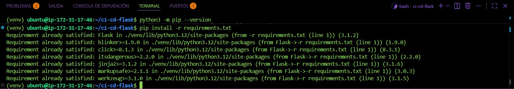
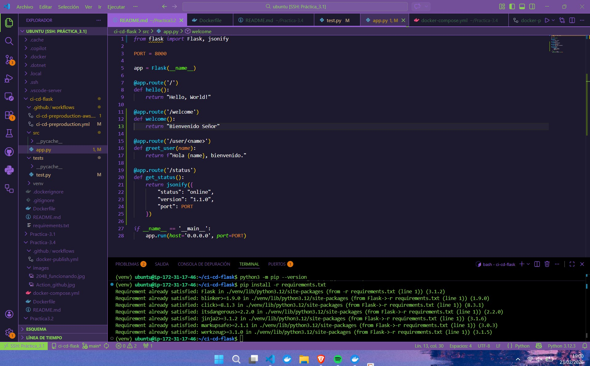
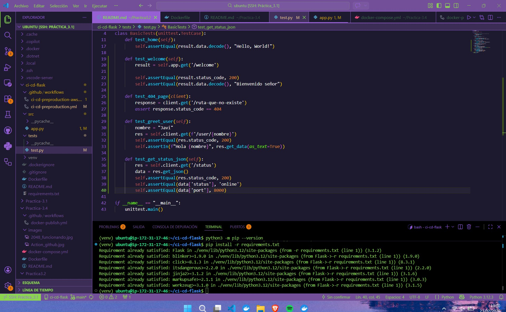
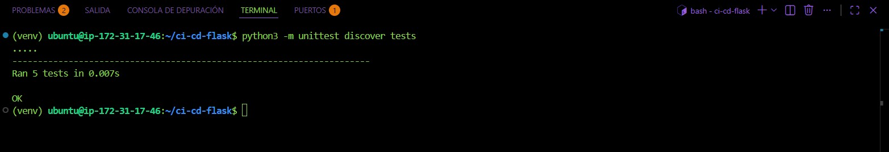
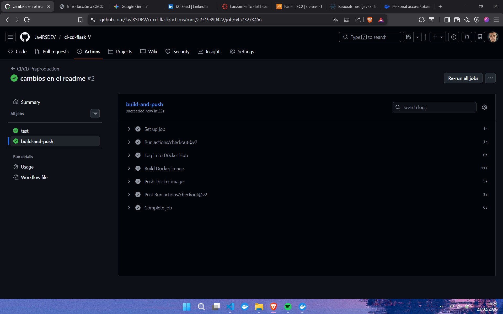

# Guía de Pasos Realizados - Práctica CI/CD Flask

Este documento resume los pasos técnicos seguidos para la configuración del flujo de integración y entrega continua del proyecto.

---

## 1. Gestión del Repositorio
* **Fork:** Se creó una copia del repositorio original en la cuenta personal de GitHub.
* **Clone:** Clonado del repositorio en la instancia de Ubuntu.
* **Configuración del Remoto:** Se cambió el `origin` para apuntar al repositorio personal y permitir el envío de cambios:
  ```bash
  git remote set-url origin [https://github.com/JaviRSDEV/ci-cd-flask.git](https://github.com/JaviRSDEV/ci-cd-flask.git)

* **Tras esto activamos el entorno virtual e instalamos todas las dependencias**


* **Se han añadido varios endpoints para luego crear tests adicionales**


* **Se han añadido varios tests para comprobar la funcionalidad de los endpoints añadidos**


* **Tras esto se han ejecutado los mismos**


* **Una vez hecho un push al repositorio que hemos clonado en nuetra cuenta, comprobamos que funcione correctamente los actions de github**
